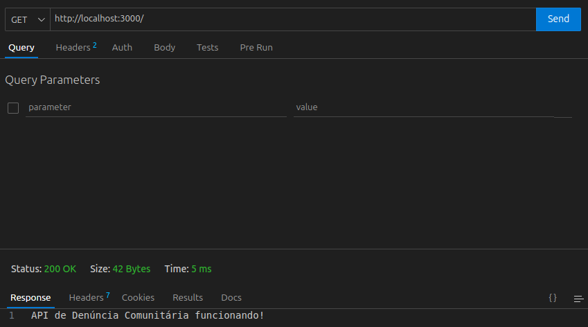
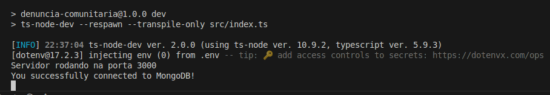

# Projeto Denuncia Comunitária

Este repositório contém um sistema para facilitar a denúncia de problemas comunitários, como buracos em ruas, falta de iluminação, entre outros. O objetivo é permitir que os cidadãos reportem esses problemas de forma rápida e eficiente, para que as autoridades competentes possam tomar as devidas providências.

## Instalação
1. Clone o repositório
2. Instale as dependências com `npm install`
3. Configure as variáveis de ambiente conforme o arquivo `.env.example`
4. Inicie o servidor com `npm start`

##  Tecnologias Utilizadas

- Node.js
- Express
- CORS
- TypeScript
- Thunder Client 
- MongoDB Atlas
- Mongoose

## Funcionalidades

A API possui a seguinte rota:

## Conexão com Banco de Dados

A API foi conectada ao MongoDB Atlas utilizando o Mongoose.

## Autoria

Este projeto foi desenvolvido por **Geovana Mendes**, estudante de Sistemas de Informação, como parte do programa **Aprofunda** da **PretaLab**.
